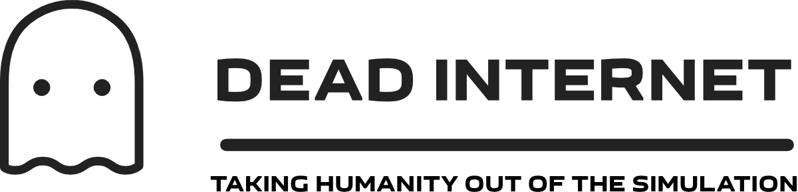

Experience the unsettling reality of modern social media through our LLM-powered simulator that reveals how bots or other actors can shape online discourse.


## Features

### 🤖 AI-Powered Interactions
Large language models create eerily human-like conversations and responses, demonstrating how AI can manipulate social discourse. Use [OpenAI's API](https://platform.openai.com) or host your own models with [Ollama](https://ollama.com) or [LM Studio](https://lmstudio.ai)!

### 👥 Simulated User Profiles
Profiles are procedurally generated based off set simulation settings. Adjust probabilities to your heart's content to ensure new users are as close to your requirements as possible.

### ⚙️ Customizable Instruction Sets
Fine-tune your simulation by providing custom instruction sets to the LLM. Implement specific settings or define new traits, biases, and behavioral patterns.

### ▶️ Automatic Simulation
Let the system run autonomously with a click of a button. Watch as the LLM generates content, creates interactions, and simulates organic community growth, and adjust how often each type of behavior is performed.

### 👤 User Insights
View your generated user profiles to understand their interests, analyze behavior patterns, and track content engagement over time.

### 💉 Content Injection
Manually inject custom content, events, users, and instruction sets to observe how they influence the simulated environment.

## Installation & Setup

1. Download the files and extract to a directory of your choice.

2. Install dependencies:
```bash
npm install && npm audit
```

3. Start the simulation:
```bash
npm run dev
```

## System Requirements

- Node.js 18+
- Modern web browser
- API key for OpenAI OR a device capable of running Ollama/LM Studio
- The 3B Llama 3.2 model works amazingly well for this type of project, and was used for much of the testing on an M1 MacOS device due to its speed.

## FAQ

### What is Dead Internet?
Dead Internet is a simulator that demonstrates how AI and bots can create the illusion of human activity on social media platforms. It was originally designed as a thought experiment and digital sandbox, but also happens to be effective at raising awareness about the prevalence of automated interactions online.

The name is taken from the "Dead Internet Theory" (though not an inspiration for the project itself), which suggests that much of the internet's activity and content is now generated by bots and AI rather than humans, leading to a decline in authentic human interaction online.

### Is this meant to create fake social media accounts?
No. Dead Internet is an educational tool designed to demonstrate and study automated behavior. It operates in an isolated environment and cannot be used to create actual social media accounts or interact with real platforms.

### Are we limited to real world environment scenarios?
Nope! Instruction sets allow you to give overrides to the LLM and lets you ignore these settings if you desire. Additionally, you can uncheck "Use region distribution weights" found inside Simulation Settings > Region Distribution.

If it helps to get started, you can use this test prompt that was created during development:

```
This social media is a Roleplay social media - similar to Dungeons and Dragons, and set in a different universe from real life earth. Theme everything possible as if it were in a fantasy world and setting. All events, comments, etc. should be in character. Technology, aside from social media, is relatively primitive unless achieved by magic. Cameras, internet, airplanes, etc. do not exist in this world.
```

### What's the price?
Dead Internet is open source and free to use, but you can always help by:
- Spreading the word
- Giving attribution when used in projects
- [Sending a tip](https://buy.stripe.com/eVa8Ax6C32q94LKdQQ) if you're feeling extra generous 🍻

## Questions or Support

- Email: deadinternet@goatbit.net
- [GitHub Discussions](https://github.com/goatbit/dead-internet/discussions)